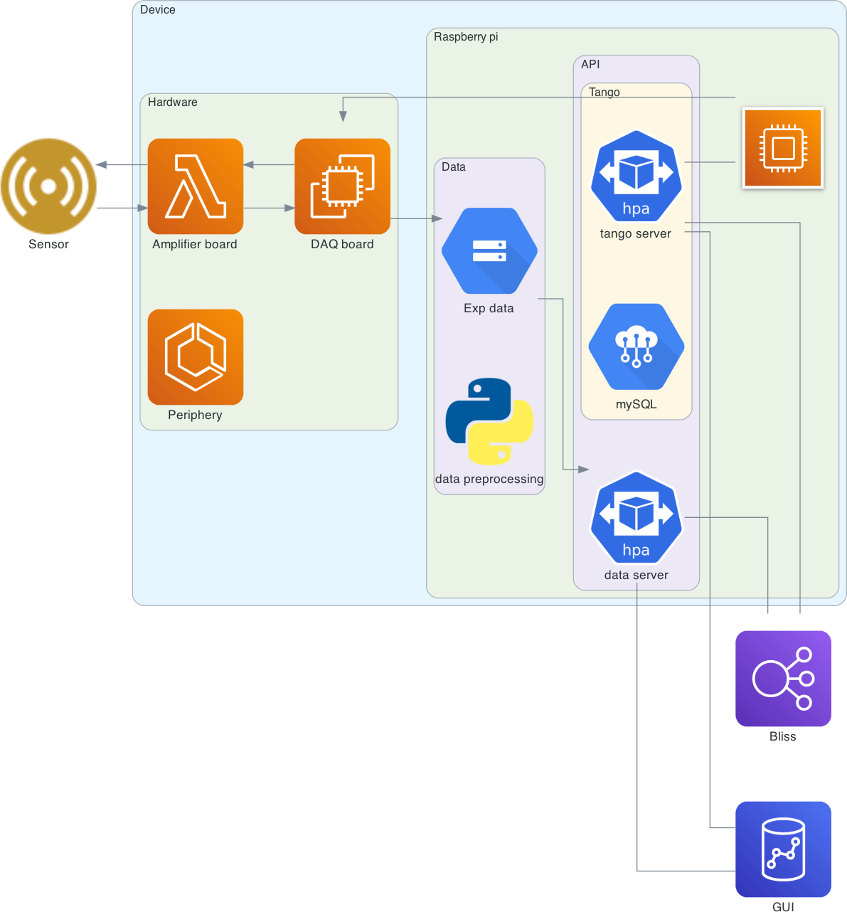

# About

**PIONER** (Platform for Integrated Operative Nano Experiments and Research,
formerly *Nanocal*) is the software stack that drives the PIONER chip
nanocalorimeter. The back end controls MCC USB-DAQ hardware (USB-2637 in
production); the front end is a Qt5 / silx GUI; a Tango server exposes the
back end over the network. Three experimental modes are supported:
`fast` (ballistic ramps), `slow` (AC-modulated lock-in calorimetry on slow
ramps), and `iso` (held-temperature AC calorimetry).

For the full project overview, hardware specs, installation, and the
calibration / pipeline / TODO references, start from the top-level
[README](../../README.md). For developer-facing build, packaging, and Sphinx
docs notes, see [for_developers](for_developers.md).

